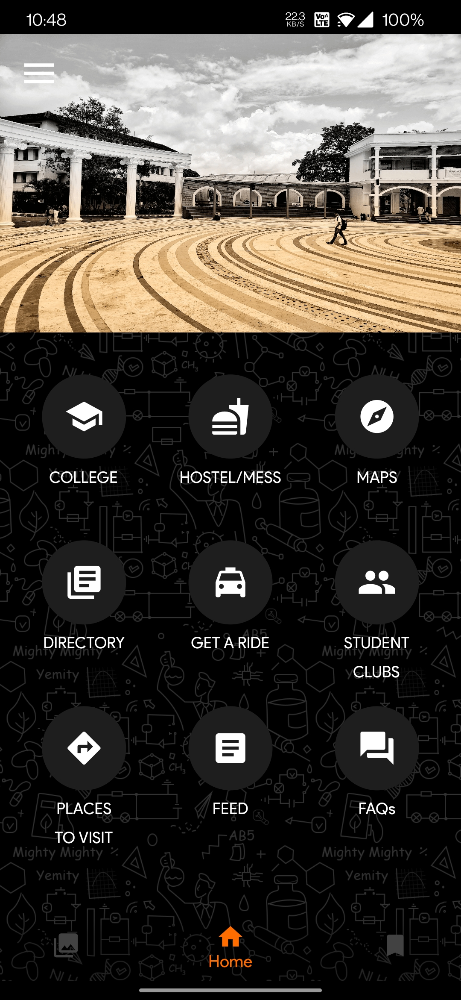
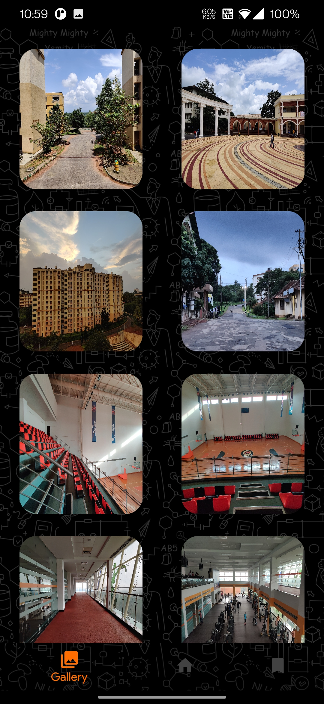
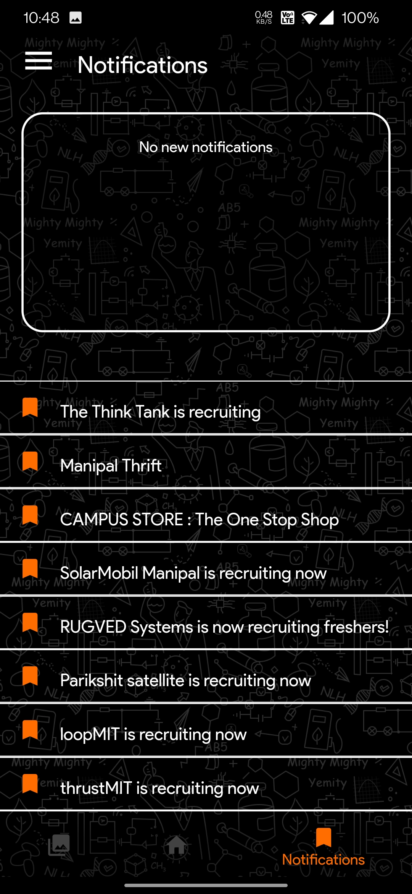

# ManipalLocals  
  
Flutter application created by [Pranshul Goyal](https://github.com/Pranshul2002)
  
## About the project  
It's tough moving to a new city, fresher’s start wondering about settling themselves and try to be more comfortable with the premises and the city. Wondering why can't they find everything easily, that too from the right places near them.  
  
## Features in the App  
The App contains information about:  
* Academic activities   
* Hostel and Mess  
* Map of the college  
* Directory  
* Cabs / Autos  
* Student CLubs  
* Places to Visit  
* Feed  
* FAQs  
* Gallery  
* Notification Centre  
  
## Technologies Used  
* Flutter  
* Dart  
*Firebase  
  * Firebase Authentication  
  * Firebase Firestore  
  * Firebase Storage  
  * Firebase Analytics  
  * Firebase Cloud Messaging  
* Shared Preference  
* Bloc

## App ScreenShots

## Installation Guide
Clone this github repository and run flutter pub get in the terminal

##Project Available at
[Web App](https://manipallocals-2f95e.web.app/#/)
[Android App](https://play.google.com/store/apps/details?id=com.manipal_locals.android&hl=en_IN&gl=US)
